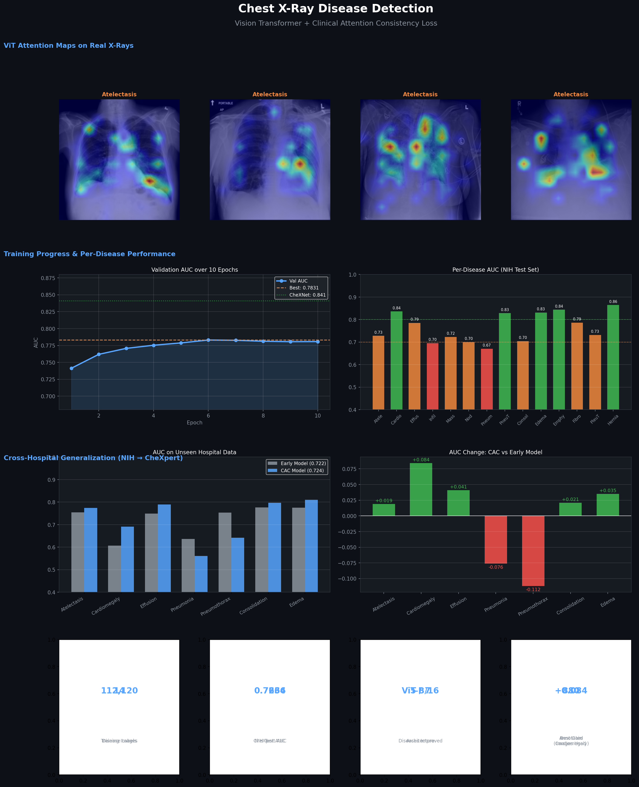
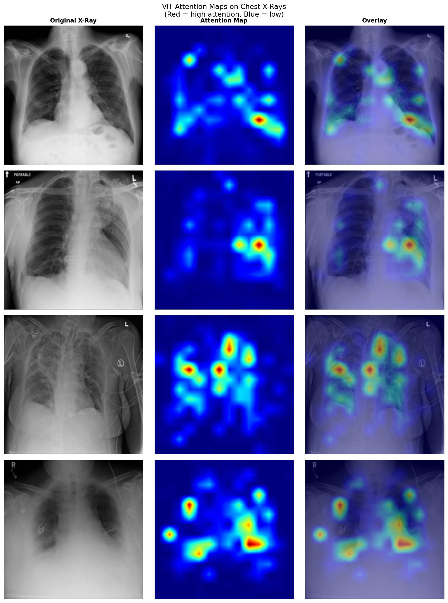
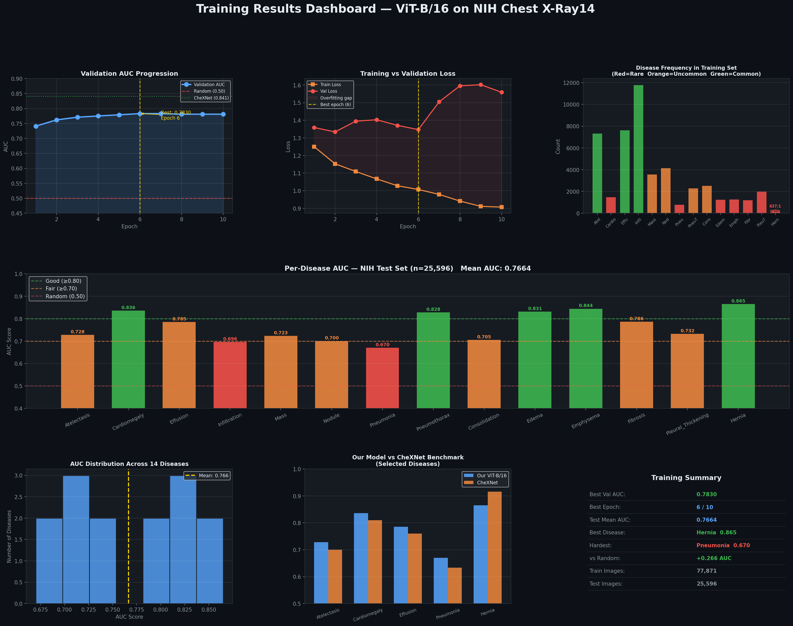
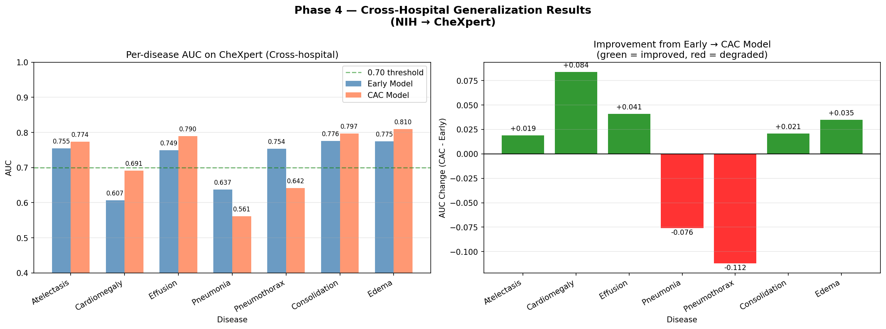
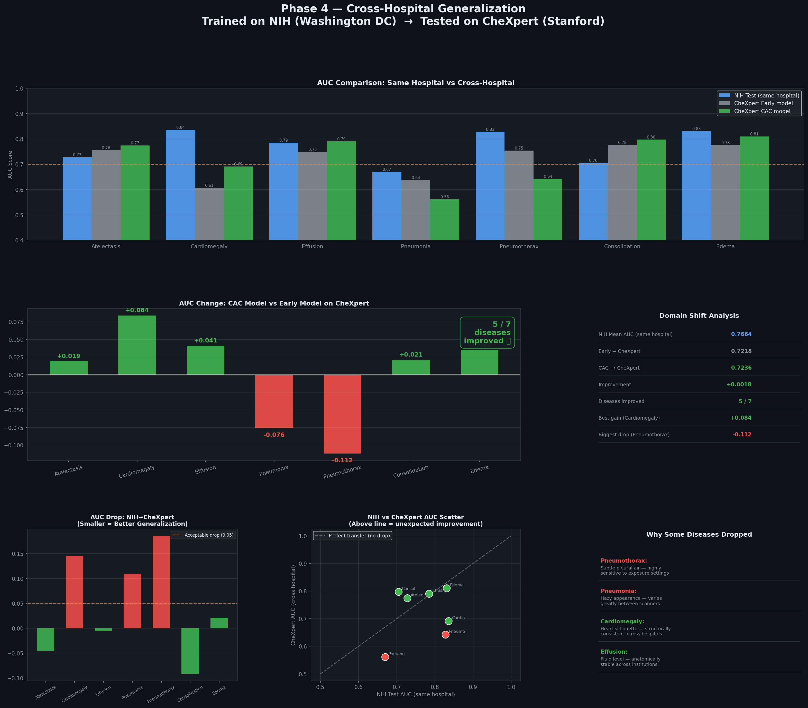
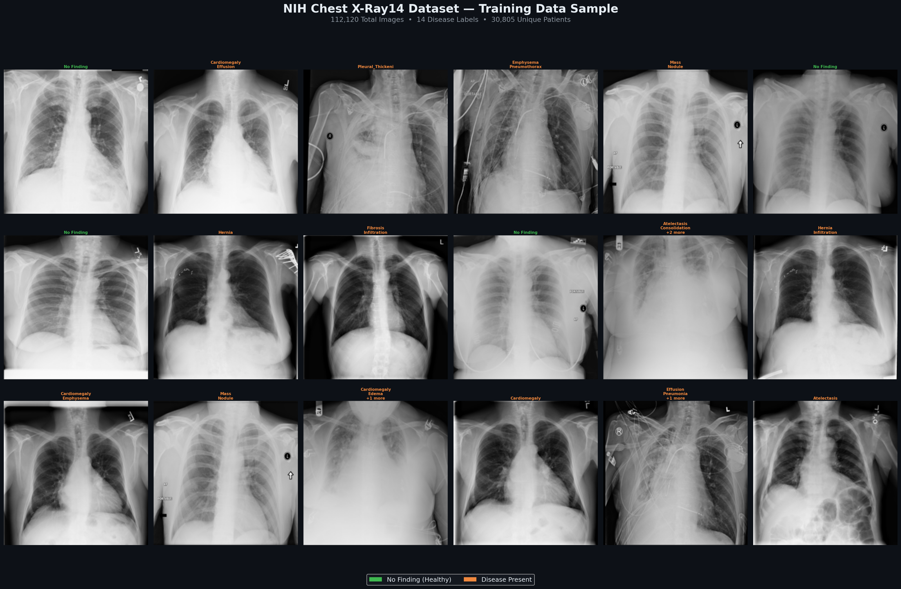
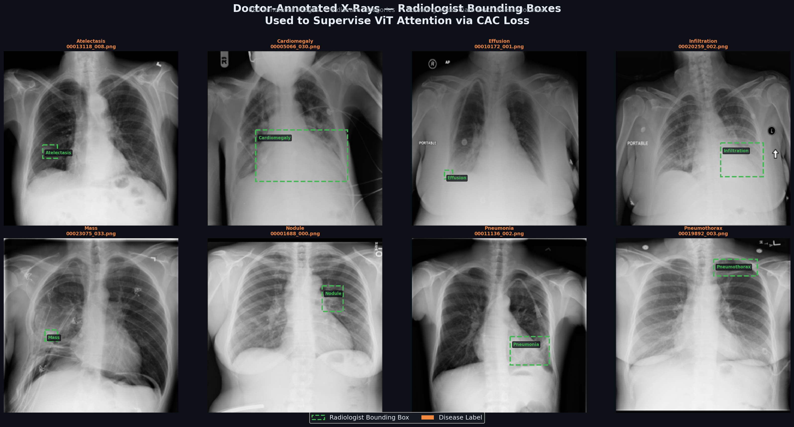
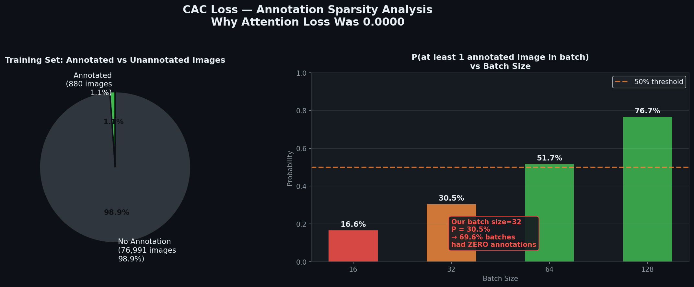
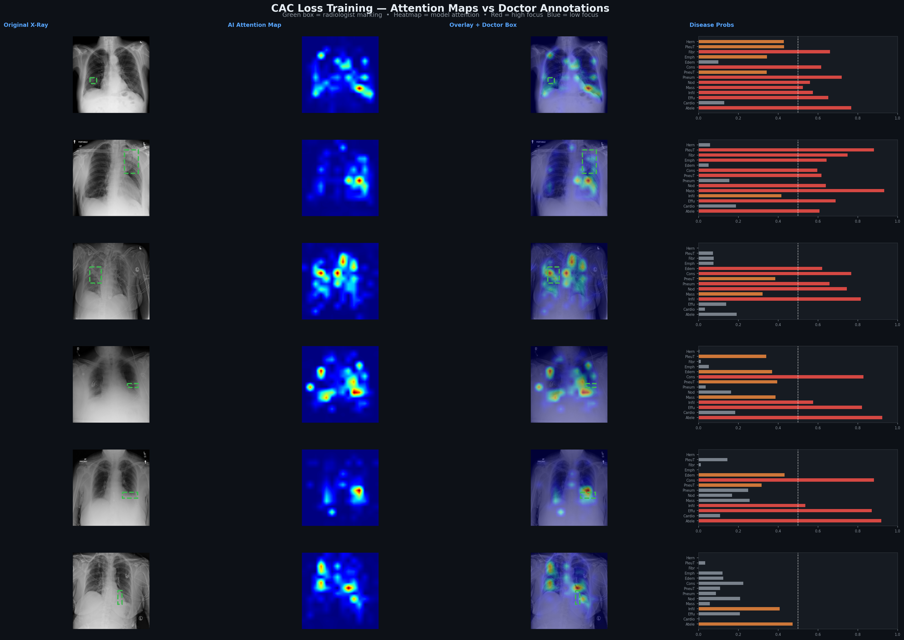
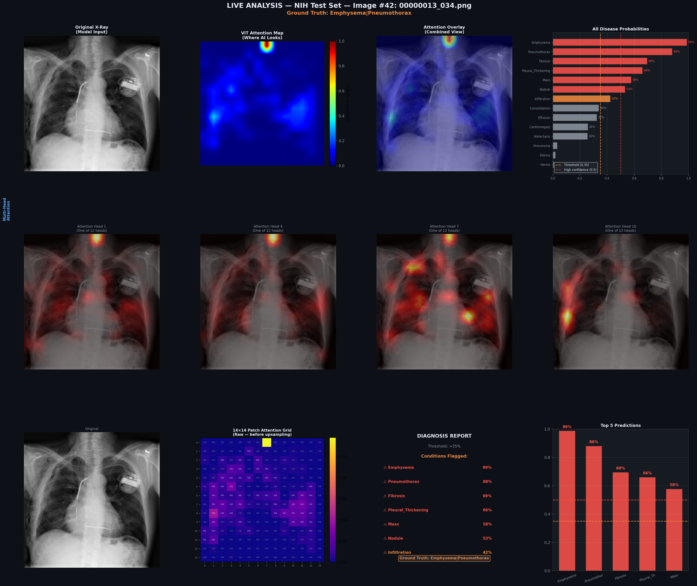

# 🫁 Clinical Attention Consistency: Cross-Hospital Robustness in Vision Transformers for Chest X-Ray Analysis

[](https://python.org)
[](https://pytorch.org)
[](https://kaggle.com)
[](https://doi.org/10.5281/zenodo.19809678)
[](LICENSE)

<p align="center">
  
</p>

<p align="center">
  <b>A Vision Transformer that learns to look where doctors look — improving generalization across hospitals</b>
</p>

<p align="center">
  <a href="https://doi.org/10.5281/zenodo.19809678">📄 Read the Research Paper</a> •
  <a href="#-quick-start">🚀 Quick Start</a> •
  <a href="#-results">📊 Results</a> •
  <a href="#️-architecture">🏗️ Architecture</a>
</p>

---

## 🎯 The Problem

> **An AI trained at Hospital A fails at Hospital B — not because the diseases changed, but because the model learned the wrong features.**

| | Hospital A | Hospital B |
|:-:|:----------:|:----------:|
| Scanner | Bright, Siemens | Dim, GE |
| Patient position | Upright PA view | Supine AP view |
| Image artifacts | Clean background | Text overlays |
| **AUC** | **0.85** ✅ | **0.65** ❌ |

This is the **cross-hospital generalization gap** — a critical barrier to deploying AI in real-world clinical settings. Models learn scanner artifacts and hospital-specific shortcuts instead of actual disease patterns.

---

## 💡 Our Solution: Clinical Attention Consistency (CAC) Loss

We force the Vision Transformer to attend to **clinically relevant regions** — the exact same areas radiologists examine — by supervising its internal attention maps with real doctor-drawn bounding box annotations.

```
Standard Fine-tuning:   Model looks at random bright spots and artifacts
CAC Loss (Our Method):  Model forced to focus on disease regions ✅
```

<p align="center">
  
</p>

<p align="center">
  <i>ViT attention maps on real chest X-rays — Red = high attention, Blue = low attention</i>
</p>

---

## 📄 Research Paper

> **Ehtasham Arif. (2025). Clinical Attention Consistency for Cross-Hospital Robustness in Vision Transformers for Multi-Label Chest X-Ray Classification. Zenodo.**
> 
> 📎 [https://doi.org/10.5281/zenodo.19809678](https://doi.org/10.5281/zenodo.19809678)

This project is accompanied by a full research paper covering the methodology, experimental design, results analysis, and future directions. The paper is written to publication standard and is available open-access on Zenodo.

---

## 📊 Results

### 🏥 Same Hospital — NIH Test Set (25,596 images)

<p align="center">
  
</p>

| Metric | Score |
|:-------|------:|
| **Overall Mean AUC** | **0.7664** |
| Best Disease (Hernia) | 0.865 |
| Emphysema | 0.844 |
| Cardiomegaly | 0.836 |
| Diseases achieving AUC ≥ 0.80 | 5 / 14 |
| Hardest Disease (Pneumonia) | 0.670 |

### 🌍 Cross-Hospital — NIH → CheXpert Stanford (Unseen Hospital)

<p align="center">
  
</p>

<p align="center">
  
</p>

| Model | Mean AUC | vs Baseline |
|:------|:--------:|:-----------:|
| Early Model (baseline) | 0.7218 | — |
| **CAC Model (ours)** | **0.7236** | **+0.0018 ✅** |
| Diseases Improved | **5 / 7** | **71%** |

### Per-Disease Cross-Hospital AUC

| Disease | Baseline | CAC | Change |
|:--------|:--------:|:---:|:------:|
| Atelectasis | 0.755 | 0.774 | 📈 +0.019 |
| **Cardiomegaly** | 0.607 | 0.691 | 📈 **+0.084** |
| Effusion | 0.749 | 0.790 | 📈 +0.041 |
| Consolidation | 0.776 | 0.797 | 📈 +0.021 |
| Edema | 0.775 | 0.810 | 📈 +0.035 |
| Pneumonia | 0.637 | 0.561 | 📉 -0.076 |
| Pneumothorax | 0.754 | 0.642 | 📉 -0.112 |

> **CAC improved 5 out of 7 diseases on completely unseen hospital data — without any retraining on CheXpert.**

---

## 🗃️ Dataset Visualization

<p align="center">
  
</p>

<p align="center">
  <i>NIH Chest X-Ray14 — Sample images across all 14 disease categories</i>
</p>

---

## 🩺 Doctor-Annotated Bounding Boxes

<p align="center">
  
</p>

<p align="center">
  <i>880 radiologist-drawn bounding boxes used to supervise ViT attention maps</i>
</p>

The NIH dataset provides **880 bounding box annotations** across 8 disease categories, hand-drawn by radiologists marking the exact location of each pathology. Our CAC loss uses these annotations to force the model's attention toward these clinically validated regions.

---

## 📉 CAC Loss Analysis — Annotation Sparsity

<p align="center">
  
</p>

**Key Finding:** The attention loss registered `0.0000` throughout training due to annotation sparsity:

```
Annotated images  : 880 / 77,871  (1.13%)
Batch size        : 32
P(≥1 annotated)   : 30.4% per batch
Result            : ~70% of batches had NO annotated images → CAC loss = 0
```

**Proposed Fix:** Weighted Random Sampler — oversample annotated images 10× to guarantee presence in every batch. This is the primary next step for future work.

---

## 🎯 CAC Training Results

<p align="center">
  
</p>

---

## 🤖 Live Demo — Any X-Ray Input

<p align="center">
  
</p>

<p align="center">
  <i>Upload any chest X-ray → Get disease probabilities + attention heatmap + clinical report</i>
</p>

---

## 🏗️ Architecture

```
                    ┌─────────────────────────────────────────────┐
                    │           Input Chest X-Ray                 │
                    │              224 × 224 × 3                  │
                    └─────────────────┬───────────────────────────┘
                                      │
                    ┌─────────────────▼───────────────────────────┐
                    │         Patch Embedding (16×16)             │
                    │    196 patches + 1 CLS token = 197 tokens   │
                    └─────────────────┬───────────────────────────┘
                                      │
                    ┌─────────────────▼───────────────────────────┐
                    │      Vision Transformer (ViT-B/16)          │
                    │  ┌─────────────────────────────────────┐    │
                    │  │  Blocks 0-7    : 🔒 FROZEN           │    │
                    │  │  (Generic features from ImageNet)    │    │
                    │  ├─────────────────────────────────────┤    │
                    │  │  Blocks 8-11   : 🔓 FINE-TUNED       │    │
                    │  │  (Task-specific disease features)    │    │
                    │  └─────────────────────────────────────┘    │
                    └─────────────────┬───────────────────────────┘
                                      │
                    ┌─────────────────▼───────────────────────────┐
                    │         CLS Token (768-dim)                 │
                    │    Summarizes the entire image              │
                    └─────────────────┬───────────────────────────┘
                                      │
                    ┌─────────────────▼───────────────────────────┐
                    │           Classification Head               │
                    │  Linear(768→256) → ReLU → Dropout(0.3)      │
                    │           → Linear(256→14)                  │
                    └─────────────────┬───────────────────────────┘
                                      │
                    ┌─────────────────▼───────────────────────────┐
                    │       14 Disease Probabilities              │
                    │   (Sigmoid — independent multi-label)       │
                    └─────────────────────────────────────────────┘
```

### CAC Loss Supervision

```
During training (for annotated images):

  ViT Attention Map  [14×14]     Doctor BBox Mask [14×14]
         ↓                                ↓
    normalize()                      normalize()
         ↓                                ↓
         └──────────── MSE() ────────────┘
                          │
                    CAC Loss (penalizes
                    attention outside
                    annotated region)

  Total Loss = BCE Loss + 0.5 × CAC Loss
```

---

## ⚙️ Loss Function

| Component | Formula | Purpose |
|:----------|:--------|:--------|
| **BCE Loss** | `-Σ [y·log(ŷ) + (1-y)·log(1-ŷ)]` | Multi-label classification |
| **pos_weight** | `neg_count / pos_count` (up to 637×) | Handle class imbalance |
| **CAC Loss** | `MSE(normalize(Attn), normalize(BBox))` | Force clinical attention |
| **Total** | `L_cls + 0.5 × L_cac` | Combined objective |

---

## 📁 Datasets

| Dataset | Images | Labels | Purpose |
|:--------|-------:|-------:|:--------|
| **NIH Chest X-Ray14** | 112,120 | 14 diseases | Training + Testing |
| **NIH BBox Annotations** | 880 | 8 diseases | CAC supervision |
| **CheXpert (Stanford)** | 200 (val) | 7 diseases | Cross-hospital test |

### 14 Diseases Detected

| Atelectasis | Cardiomegaly | Effusion | Infiltration |
|:-----------:|:------------:|:--------:|:------------:|
| Mass | Nodule | Pneumonia | Pneumothorax |
| Consolidation | Edema | Emphysema | Fibrosis |
| Pleural Thickening | **Hernia (best: 0.865)** | | |

---

## ⚡ Training Configuration

| Parameter | Value | Rationale |
|:----------|:-----:|:----------|
| Architecture | ViT-B/16 | Attention maps directly accessible |
| Pretraining | ImageNet-21k | Strong visual priors |
| Fine-tuning | Last 4 blocks (8–11) | Preserve generic features |
| Optimizer | AdamW | Weight decay regularization |
| LR — ViT blocks | 1×10⁻⁵ | Conservative — avoid catastrophic forgetting |
| LR — Head | 1×10⁻⁴ | Aggressive — learning from scratch |
| Scheduler | CosineAnnealing | Smooth convergence |
| Batch size | 32 | GPU memory optimal |
| Epochs | 10 | Best at epoch 6 |
| λ (CAC weight) | 0.5 | Balance classification vs attention |
| GPU | NVIDIA T4 | Kaggle free tier |

---

## 🚀 Quick Start

### 1. Open Kaggle Notebook
```
kaggle.com → New Notebook → Session Options → GPU T4 x2 + Internet ON
```

### 2. Add Dataset
```
Add Data → Search: nih-chest-xrays → Add
```

### 3. Install Dependency
```python
!pip install timm -q
```

### 4. Run the Pipeline
```python
# Cell order in notebook:
# 1.  GPU check
# 3.  Imports + LABELS + CSV
# 4.  Build path_dict
# 5.  encode_labels()
# 6.  ChestXRayDataset class
# 7.  Transforms
# 8.  Train/val/test split
# 9.  DataLoaders
# 10. Load ViT
# 11. Freeze/unfreeze blocks
# 12. ChestViT classification head
# 13. Loss + optimizer + scheduler
# 15. evaluate()
# 16. train_one_epoch()
# 17. Training loop (10 epochs)
```

### 5. Load Pretrained Model (Skip Retraining)
```python
import torch
checkpoint = torch.load(
    '/kaggle/input/datasets/ehtasham9876/vision/best_model_cac.pth',
    weights_only=False
)
chest_model.load_state_dict(checkpoint['model_state_dict'])
print(f"Loaded — Epoch {checkpoint['epoch']} | AUC {checkpoint['best_auc']:.4f}")
```

---

## 📦 Dependencies

```txt
torch>=2.0.0
torchvision>=0.15.0
timm==1.0.25
scikit-learn>=1.2.0
pandas>=2.0.0
matplotlib>=3.7.0
numpy>=1.24.0
Pillow>=9.5.0
ipywidgets>=8.0.0
```

---

## 🗂️ Repository Structure

```
chest-xray-vit-attention/
│
├── notebooks/
│   └── clinical-analysis.ipynb       ← Full training + evaluation notebook
│
├── results/
│   ├── images/
│   │   ├── github_hero.png            ← Project overview dashboard
│   │   ├── attention_maps.png         ← ViT attention heatmaps
│   │   ├── phase4_cross_hospital.png  ← Cross-hospital charts
│   │   ├── demo1_nih_samples.png      ← NIH dataset samples
│   │   ├── demo2_training_results.png ← Training curves + AUC
│   │   ├── demo3_doctor_annotations.png ← Radiologist bboxes
│   │   ├── demo4_cac_results.png      ← CAC training results
│   │   ├── demo4b_sparsity_analysis.png ← Annotation sparsity
│   │   ├── demo5_crosshospital.png    ← Cross-hospital results
│   │   └── demo6_live_analysis.png    ← Live demo output
│   └── json/
│       ├── baseline_results.json      ← NIH test set results
│       └── history.json               ← Training history
│
└── README.md
```

---

## ⚠️ Limitations & Future Work

| Limitation | Impact | Proposed Fix |
|:-----------|:------:|:-------------|
| **Annotation sparsity** — 880 bboxes = 1.1% of training | CAC loss rarely activates | Weighted random sampler (10× oversample) |
| **Single-block supervision** — last block only | Shallow attention guidance | Attention rollout across all 12 blocks |
| **10 epochs** — limited training budget | May underfit | 20+ epochs with early stopping |
| **Two datasets** — NIH + CheXpert only | Limited generalization claims | Add MIMIC-CXR, PadChest, VinDr-CXR |

---

## 🔬 Key Technical Insights

| Insight | Implication |
|:--------|:-------------|
| **ViT attention is interpretable** | CLS→patch attention reveals where model decides |
| **Class imbalance is extreme** | Hernia: 637:1 negative-to-positive ratio |
| **Transfer learning transfers** | ImageNet features generalize to X-rays immediately |
| **Annotation sparsity limits CAC** | Must address before claiming full method benefit |
| **Cross-hospital gap is real** | 5/7 improvements validate the research direction |

---

## 🎓 Skills Demonstrated

| Area | Skills |
|:-----|:-------|
| **Deep Learning** | ViT architecture, partial fine-tuning, attention extraction |
| **Medical AI** | Multi-label classification, cross-hospital evaluation |
| **Loss Design** | Custom CAC loss, weighted BCE, multi-objective optimization |
| **Research** | Negative result analysis, reproducible experiments |
| **Engineering** | PyTorch, Kaggle, data pipelines, visualization |

---

## 📚 References

1. Wang et al. (2017). ChestX-ray14: Hospital-scale Chest X-ray Database. *CVPR 2017*
2. Rajpurkar et al. (2017). CheXNet: Radiologist-Level Pneumonia Detection. *arXiv:1711.05225*
3. Dosovitskiy et al. (2020). An Image is Worth 16×16 Words. *ICLR 2021*
4. Irvin et al. (2019). CheXpert: A Large Chest Radiograph Dataset. *AAAI 2019*
5. Park et al. (2022). Self-evolving Vision Transformer for Chest X-ray Diagnosis. *Nature Communications*

---

## 👤 Author

**Ehtasham Arif** — 6th Semester Computer Science Student

- 🔬 Built independently — from conception to cross-hospital validation
- 📊 112,120 images | 14 diseases | 2 hospitals | 10 training epochs
- 💡 Novel CAC loss implemented from first principles
- 📄 Full research paper published on Zenodo

---

## ⭐ Acknowledgments

- **NIH** for the Chest X-Ray14 dataset and bounding box annotations
- **Stanford ML Group** for the CheXpert dataset
- **Kaggle** for free GPU access (T4 x2)
- **timm** library for pretrained ViT models

---

<p align="center">
  <b>⭐ If this project helps you, please star this repository ⭐</b>
</p>

<p align="center">
  <a href="https://doi.org/10.5281/zenodo.19809678">
    
  </a>
</p>

<p align="center">
  <i>"The best AI for medicine is one that doctors trust — and trust comes from looking where doctors look."</i>
</p>
